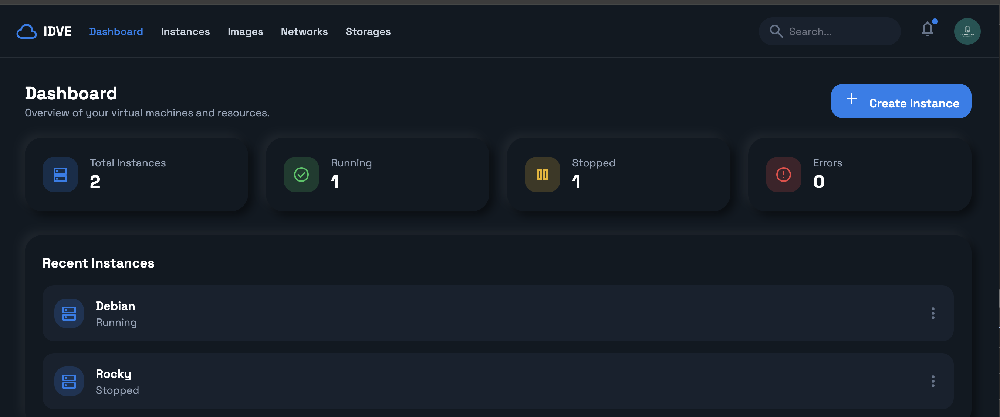
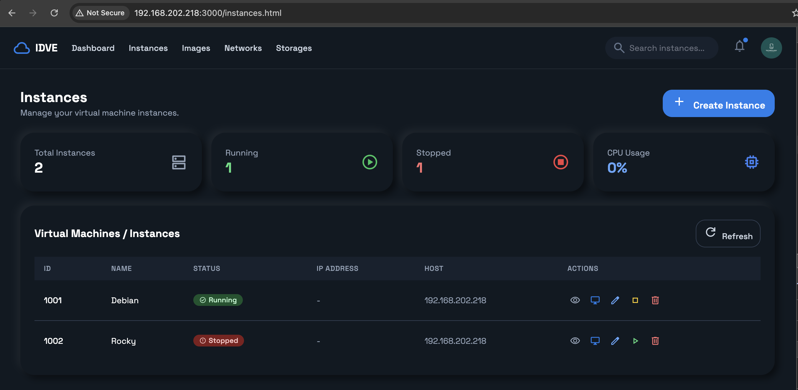
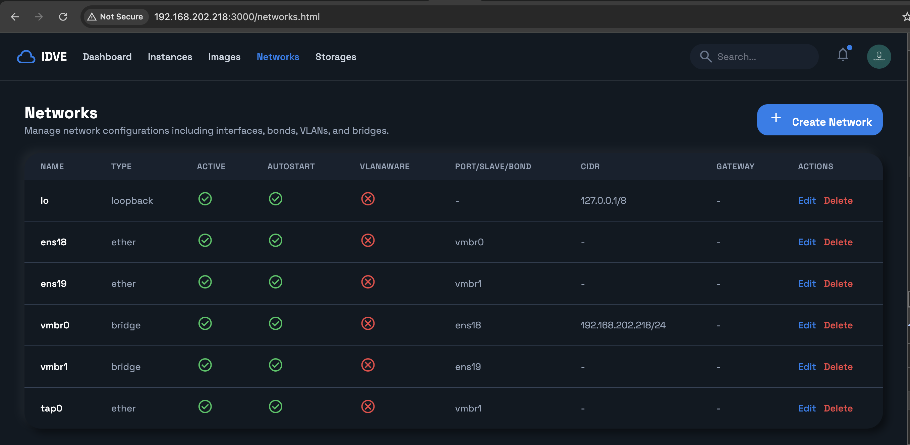
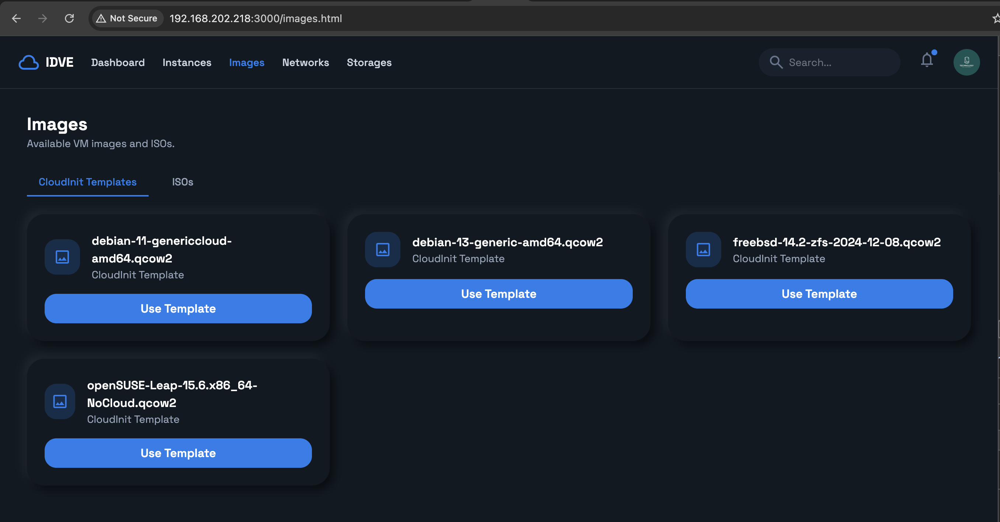

# IDVE Dash*Watch the demo video above to see IDVE Dashboard in action!*

## 📸 Screenshots

### Dashboard Overview


### Virtual Machine Instances


### Network Management


### Storage Management


## 🚀 Featuresrd

A modern, web-based dashboard for managing virtual machines and network infrastructure. Built with Node.js, Express, and Socket.IO, featuring a beautiful Tailwind CSS interface.

## � Demo Video

<video width="100%" controls>
  <source src="documentations/idve-dash.mov" type="video/quicktime">
  Your browser does not support the video tag.
</video>

*Watch the demo video above to see IDVE Dashboard in action!*

## �🚀 Features

### Virtual Machine Management
- **Create VMs** with comprehensive configuration options
- **QEMU/KVM integration** with full hardware virtualization
- **Cloud-init support** for automated VM provisioning
- **Real-time monitoring** via WebSocket connections
- **Multiple storage formats** (QCOW2, RAW)
- **Network configuration** with bridge and VLAN support
- **MAC address auto-generation** with uniqueness validation
- **TPM 2.0 emulation** for Windows VMs
- **VirtIO drivers** for optimal performance

### Network Management
- **Bridge creation and management** with physical interface bonding
- **VLAN support** for network segmentation
- **Real-time network status** monitoring
- **Interface availability** detection
- **Persistent configuration** with `/etc/network/interfaces`

### Storage Management
- **Multiple storage pools** (Local, NFS, etc.)
- **ISO image management** for VM installation
- **Disk image storage** and organization
- **Shared storage** configuration

### User Interface
- **Modern dark/light theme** with clay-morphism design
- **Responsive design** for desktop and mobile
- **Real-time updates** via Socket.IO
- **Intuitive navigation** with tabbed interface
- **Form validation** and error handling

## 🛠️ Technology Stack

- **Backend**: Node.js, Express.js
- **Frontend**: HTML5, Tailwind CSS, JavaScript
- **Real-time**: Socket.IO
- **Virtualization**: QEMU/KVM
- **Network**: Linux Bridge, VLAN
- **File Upload**: Multer

## 📋 Prerequisites

- Node.js 16+
- QEMU/KVM
- Linux Bridge utilities (`brctl`)
- Systemd networking
- Root access for network configuration

## 🚀 Installation

1. **Clone the repository**
   ```bash
   git clone git@repo.indobsd.id:dionipe/idve-dash.git
   cd idve-dash
   ```

2. **Install dependencies**
   ```bash
   npm install
   ```

3. **Start the application**
   ```bash
   npm start
   ```

4. **Access the dashboard**
   Open your browser and navigate to `http://localhost:3000`

## 📁 Project Structure

```
idve-dash/
├── server.js              # Main application server
├── package.json           # Dependencies and scripts
├── public/                # Frontend assets
│   ├── index.html         # Main dashboard
│   ├── images.html        # Storage management
│   ├── networks.html      # Network management
│   ├── storages.html      # Storage pools
│   ├── script.js          # Main JavaScript
│   ├── images.js          # Storage JavaScript
│   ├── networks.js        # Network JavaScript
│   ├── storages.js        # Storage JavaScript
│   └── styles.css         # Additional styles
├── documentations/        # Documentation files
└── node_modules/          # Dependencies
```

## 🔧 Configuration

### Network Configuration
The application manages network interfaces through `/etc/network/interfaces`. Ensure the application has root privileges for network operations.

### Storage Paths
- VM instances: `/var/lib/idve/instances/`
- ISO images: `/var/lib/idve/isos/`
- Images: `/var/lib/idve/images/`

## 📡 API Endpoints

### Virtual Machines
- `GET /api/instances` - List all VM instances
- `POST /api/instances` - Create new VM
- `DELETE /api/instances/:id` - Delete VM

### Networks
- `GET /api/networks` - List all networks
- `POST /api/networks` - Create new network
- `PUT /api/networks/:name` - Update network
- `DELETE /api/networks/:name` - Delete network

### Storage
- `GET /api/storages` - List storage pools
- `POST /api/storages` - Create storage pool
- `PUT /api/storages/:name` - Update storage pool
- `DELETE /api/storages/:name` - Delete storage pool

## 🔒 Security Considerations

- Run with appropriate privileges for system operations
- Configure firewall rules for VM network access
- Monitor system resources for VM operations
- Regular backup of VM configurations

## 💝 Support

If you find this project helpful, consider supporting the development:

[](https://saweria.co/dionipe)

## 🤝 Contributing

1. Fork the repository
2. Create a feature branch (`git checkout -b feature/amazing-feature`)
3. Commit your changes (`git commit -m 'Add amazing feature'`)
4. Push to the branch (`git push origin feature/amazing-feature`)
5. Open a Pull Request

## 📝 License

This project is licensed under the ISC License - see the [LICENSE](LICENSE) file for details.

## 👥 Authors

- **Dionipe** - *Initial work* - [dionipe](https://github.com/dionipe)

## 🙏 Acknowledgments

- Built with [Tailwind CSS](https://tailwindcss.com/)
- Icons from [Material Symbols](https://fonts.google.com/icons)
- Real-time communication via [Socket.IO](https://socket.io/)
- Virtualization powered by [QEMU](https://www.qemu.org/)